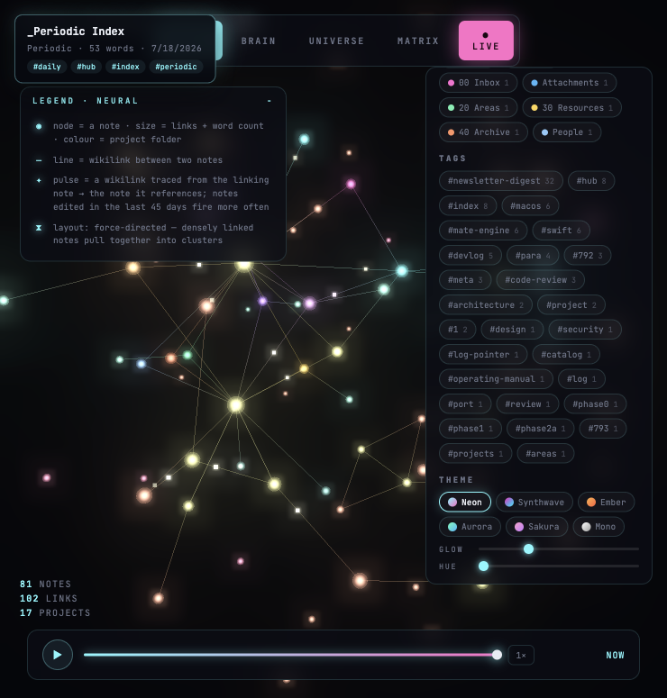
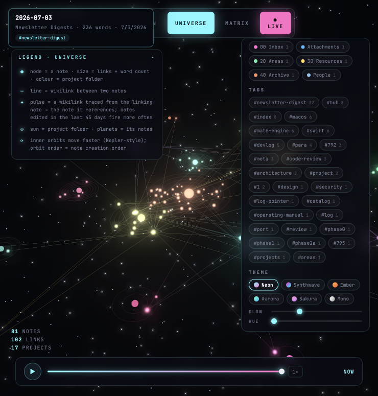
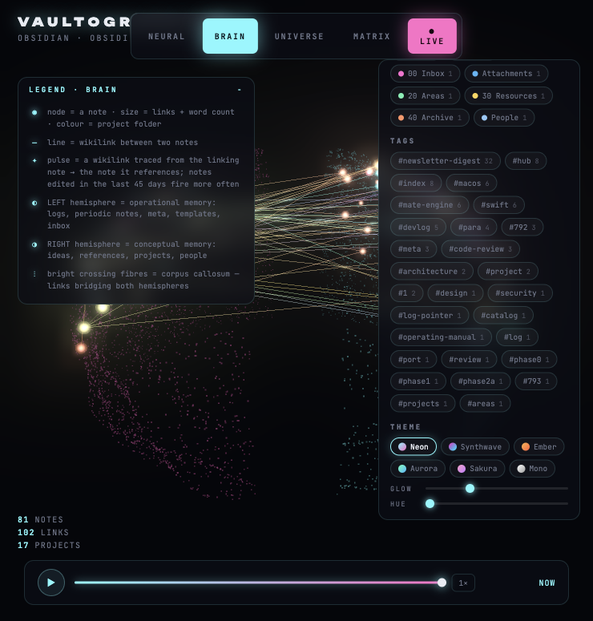
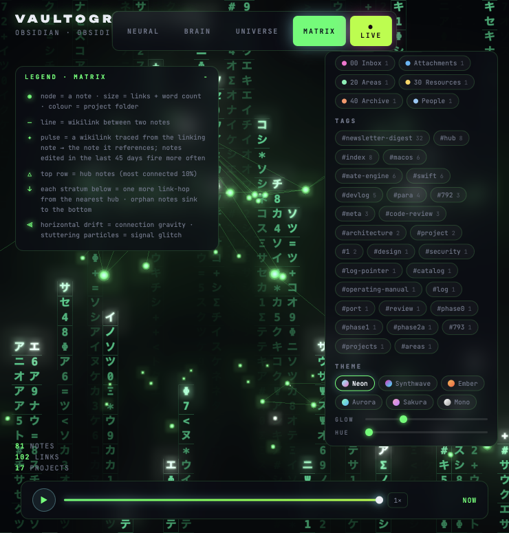

# Vaultographiter

**An interactive 3D cartographer for your Obsidian vault.**

Vaultographiter scans an [Obsidian](https://obsidian.md) vault, builds the wikilink graph, and renders it as a living WebGL scene — four visualization modes, a replay timeline that regrows your vault from its first note, and a live mode that lights up nodes as you edit files in Obsidian.



## Modes

| | |
|---|---|
|  **Neural** — force-directed synapse graph. Densely linked notes cluster; pulses trace wikilinks from linker → linked, firing more often for recently edited notes. |  **Universe** — every project folder is a sun, its notes are planets on Kepler-style orbits (inner orbits move faster; orbit order = creation order). |
|  **Brain** — a point-cloud cortex with *semantic* hemispheres: left = operational memory (logs, periodic notes, meta, templates, inbox), right = conceptual memory (ideas, references, projects, people). Bright crossing fibres are the corpus callosum — links bridging both. |  **Matrix** — digital-rain lattice. Hub notes (top 10% most connected) form the top row; every stratum below is one more link-hop away. Orphans sink to the bottom. Glitches are per-particle, as they should be. |

## Features

- **Hover & inspect** — hover any node for a tooltip (title, project, word count, modified date, tags); click for a detail card with an excerpt, outlinks, and backlinks you can navigate through
- **Live mode** — a file watcher streams vault changes over WebSocket; created/edited notes flash into the scene in real time
- **Replay timeline** — scrub or play through your vault's history and watch it grow note by note
- **Filters** — full-text search, project chips, and tag chips dim everything that doesn't match
- **Themes** — six presets (Neon, Synthwave, Ember, Aurora, Sakura, Mono) plus glow (bloom 0–2×) and hue-shift sliders, persisted locally. On the grayscale Mono preset the hue slider *colorizes* instead of rotating — instant green-phosphor or amber-CRT duotones
- **Glass-orb nodes** — custom fresnel shader: emissive plasma core, translucent tinted rim, additive blending. Every node clears the bloom threshold regardless of its palette color
- **In-scene legend** — every mode explains exactly what its dots, lines, pulses, and strata mean

## Getting started

Requires **Node.js ≥ 20**.

```bash
git clone https://github.com/Philificent/vaultographiter.git
cd vaultographiter
npm install

# point it at your vault (defaults to ~/Documents/Obsidian)
VAULT_PATH="/path/to/your/vault" npm run dev
```

Then open **http://localhost:5173**.

`npm run dev` starts both processes:

| Process | Port | Role |
|---|---|---|
| `server/index.mjs` | 4400 | scans the vault, watches for changes (chokidar), serves `/api/vault` + `/api/note`, streams patches over `/ws` |
| Vite dev server | 5173 | frontend, proxies `/api` and `/ws` to :4400 |

### Configuration

| Env var | Default | |
|---|---|---|
| `VAULT_PATH` | `~/Documents/Obsidian` | path to the vault to visualize |
| `PORT` | `4400` | backend port |

Everything runs locally — your notes never leave your machine. The `/api/note` endpoint serves excerpts (capped at 1400 chars) only for paths inside the vault root.

## Controls

| Input | Action |
|---|---|
| drag / scroll | orbit / zoom (OrbitControls) |
| hover node | tooltip |
| click node | detail card with excerpt + link navigation |
| top bar | switch mode (Neural / Brain / Universe / Matrix), toggle Live |
| bottom bar | replay timeline: play, scrub, speed |
| right panel | search, project & tag filters, theme presets, glow & hue sliders |

## How the graph is built

- **Node** = one markdown note. Size encodes links + word count; color encodes project (top-level folder).
- **Edge** = a `[[wikilink]]` between two notes.
- **Pulse** = a wikilink traced from the linking note toward the note it references. Notes edited in the last 45 days fire more often — motion means recency, not decoration.
- Frontmatter `created` overrides file birthtime for the replay timeline, so template-dated notes land in the right era.

## Stack

TypeScript · [Three.js](https://threejs.org) (InstancedMesh, custom GLSL, UnrealBloom) · Vite · Express · chokidar · ws · gray-matter. No database, no cloud, no telemetry.

## License

[MIT](LICENSE)
